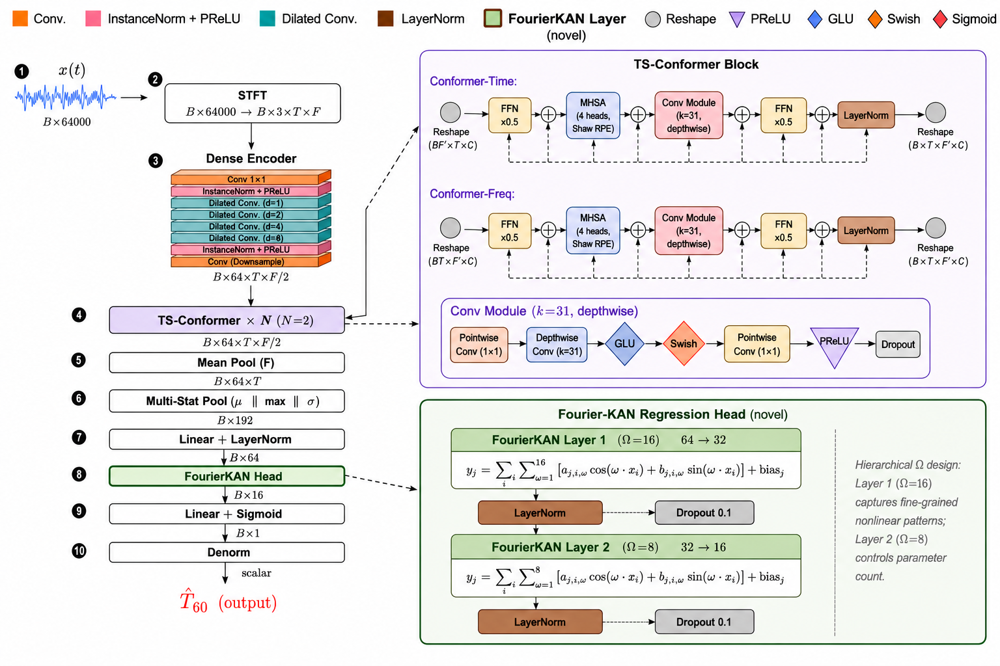

# 去噪辅助监督下的多任务盲混响时间估计：基于 Fourier Kolmogorov–Arnold 回归头的 Conformer 方法

**作者：** 谢欣妮、陆锡堃、桑晋秋（华东师范大学）

> 📌 **本文档为 review 用中文稿。** 与英文版 `docs/main.tex` 一一对应；先于此处修改，经确认后落到英文版。
> 公式编号与英文版顺序一致；引用 `（作者，年份）` 对应 `refs.bib` 的 key。
> 标注 **【TODO-多任务】** 的段落为原英文单任务表述、与多任务主线冲突，待对应章节统一改写。

---

## 摘要

混响时间 $T_{60}$ 是最具信息量的房间声学参数之一，然而从单通道含噪混响录音中进行盲估计仍然困难，因为晚期混响尾在能量上天然偏弱，极易被加性噪声掩蔽。我们提出一个面向盲 $T_{60}$ 估计的多任务学习框架：以 $T_{60}$ 回归为主任务，以去噪重建（含噪混响语音 $\to$ 无噪混响语音）为辅助任务，二者共享一个 dual-path time–frequency Conformer backbone。含噪混响语音的复短时傅里叶频谱经稠密卷积编码器与两个 time–frequency Conformer 块（TSCB）处理后，瓶颈特征由多统计量池化层聚合，再经两层 Fourier-KAN 头映射到 $T_{60}$；与此同时，同一瓶颈特征经掩码解码器与复数解码器重建增强语音。去噪辅助任务信息密集的逐时频点监督，迫使共享层学习精细的时频判别特征；我们验证了这种由去噪驱动的表征反过来会显著改善 $T_{60}$ 估计。与相近容量的多层感知机（MLP）回归头相比，Fourier 基把每条边上的激活函数表达为可学习的三角级数，与池化声学统计量到目标 $T_{60}$ 之间光滑但非线性的依赖关系天然契合。在覆盖仿真与真实房间脉冲响应（RIR）、已见与未见噪声类型的四个含噪混响测试集上，所提模型取得平均均方根误差（RMSE）【待补】ms、平均绝对误差（MAE）【待补】ms、Pearson 相关系数【待补】；相比单任务消融基线（861,793 参数，RMSE 111.15 ms）RMSE 降低【待补】%。encoder 与 Conformer 主干为两任务共享，去噪辅助任务新增两个解码器约 0.54M 参数，总参数 1.41M。梯度探针分析进一步揭示，两个任务的梯度方向在整个训练过程中近似正交（无系统性冲突），决定最终性能的是梯度幅度比 $r=\lVert\mathbf{g}_{T_{60}}\rVert/\lVert\mathbf{g}_{\text{denoise}}\rVert$：$r$ 越小（去噪任务主导共享层），$T_{60}$ 估计越准。

**关键词：** 盲混响时间估计、多任务学习、去噪辅助监督、Conformer、Kolmogorov–Arnold 网络、Fourier 基、噪声鲁棒性

---

## 1 引言

当声源在一个封闭空间中发声时，接收端不仅捕获直达声，还会接收到来自周围壁面的大量反射声（Kuttruff 等，2013）。这些反射声随时间衰减，共同构成房间的混响。声源停止后，声能衰减 60 dB 所需的时间被定义为混响时间 $T_{60}$（ISO 3382-2，2008）。作为一个概括房间能量衰减行为的标量，$T_{60}$ 是表征封闭空间声学属性最常用的参数之一，直接影响语音质量、可懂度，以及去混响、语音识别、声源定位、虚拟/增强现实渲染等下游音频应用的性能（Benzeghiba 等，2007；Anthes 等，2016）。标准化测量 $T_{60}$ 的方法包括中断噪声法与积分脉冲响应法（Schroeder，1965），二者均需要全向声源、校准过的传声器与训练有素的操作人员。但这类现场测量既不便携，且在大规模或现场测量时成本高昂、实现复杂。因此，*盲*估计方法应运而生：在没有任何专用激励信号或房间几何先验的前提下，直接从录制的语音信号中推断 $T_{60}$（Eaton 等，2016）。

过去二十年间，盲 $T_{60}$ 估计积累了大量工作。传统方法依赖统计信号处理：基于模型的估计器将房间脉冲响应（RIR）的晚期部分建模为阻尼高斯过程（Polack，1988），从能量包络的衰减速率恢复 $T_{60}$；基于特征映射的估计器则从手工设计的声学描述子（如衰减速率的负侧方差、谐波分量的音高强度或谱衰减分布）中推导 $T_{60}$（Ratnam 等，2003；Wen 等，2008；Eaton 等，2013；Falk 等，2010；Löllmann 等，2010）。ACE 挑战赛对这些方法作了系统评测（Eaton 等，2016），同时也暴露出两个反复出现的困难：（i）多数估计器受加性噪声正偏置影响，因为类噪声的混响尾被埋没在噪声之中；（ii）解析衰减模型在非平稳或低信噪比（SNR）场景下十分脆弱。即便是带噪声鲁棒性改进的版本，如降低计算量的谱衰减分布估计器（Eaton 等，2013）或子带分解估计器（Prego 等，2015），仍需要一个相对准确的噪声水平先验估计，而噪声非平稳时这本身就是一个难题。

深度学习随后成为一种数据驱动的替代方案。Gamper 等（2018）将 log-mel 特征送入一个六层卷积网络，赢得 ACE 单通道赛道；Xiong 等（2018）将 $T_{60}$ 与早期混响比的联合估计建模为时频特征上的分类问题；Deng 等（2020）引入卷积循环网络以在变长语音上在线估计；Srivastava 等（2021）将该框架推广到多通道输入；Götz 等（2023）用三种卷积循环变体处理动态声学条件下的参数估计；Saini 等（2023）证明 MobileViT 风格的 transformer 可在智能手机上实时运行，而 Duangpummet 等（2022）则从全频带 $T_{60}$ 走向 $T_{60}$、早期衰减时间、清晰度与语音传输指数的联合估计。与本文最相关的是 Zheng 等（2022）和 Zhang 等（2024）：他们探索了将 $T_{60}$ 回归与一个辅助去噪目标配对的多任务形式，并观察到去噪任务能改善 $T_{60}$ 估计。尽管上述数据驱动模型在干净或高 SNR 条件下明显优于统计信号处理基线，两个普遍挑战仍贯穿这一系列工作。其一，晚期混响尾在能量上天然偏弱，易被真实噪声掩蔽，估计精度在低 SNR 或未见噪声场景下仍明显下降；已有工作主要依赖 backbone 自身容量来获取噪声鲁棒性，但这能否驱动底层学到精细的时频判别特征并不明朗，而精确的 $T_{60}$ 恰恰依赖对衰减包络细节的感知。其二，几乎所有现有估计器都在时频 backbone 之上堆叠全连接层作为回归器，每个神经元仅施加单一固定非线性，对池化瓶颈特征到标量 $T_{60}$ 这条光滑但非平凡的映射，表达能力有限。

为应对上述挑战，我们提出一个面向盲 $T_{60}$ 估计的多任务学习框架，围绕三个核心设计。其一，我们在 dual-path time–frequency Conformer encoder 基础上引入一个去噪重建辅助任务，二者共享 encoder 与 trunk。去噪任务要求网络从含噪混响频谱中分离噪声、重建无噪混响语音；这一逐时频点、信息密集的监督迫使共享层学习精细的时频判别特征，我们验证了这种由去噪驱动的表征反过来会改善 $T_{60}$ 估计。其二，我们设计了一个轻量化的 Fourier 基 Kolmogorov–Arnold 回归头，其可学习的一元边函数取代常规 MLP 的固定标量非线性，为池化特征到标量 $T_{60}$ 的光滑非线性映射提供强归纳偏置。其三，我们通过系统的梯度探针与表征分析，揭示去噪辅助监督起作用的机制：两任务梯度方向近似正交而非对抗，真正决定性能的是梯度幅度比——让更复杂的去噪任务主导共享层、更简单的 $T_{60}$ 任务作为附属，反而使后者受益。
**主要贡献。** 我们的具体贡献如下。

1. 我们提出一个面向盲 $T_{60}$ 估计的多任务框架：以 $T_{60}$ 回归为主任务、去噪重建为辅助任务，共享 dual-path time–frequency Conformer backbone。两任务共享 encoder 与 trunk，$T_{60}$ 估计的 RMSE 相比单任务消融基线（111.15 ms）降低【待补】%（【待补】ms 对 111.15 ms），代价是新增两个去噪解码器（约 0.54M 参数；总参数 1.41M，单任务为 861,793）。据我们所知，这是首次将去噪辅助监督系统性地引入 dual-path time–frequency Conformer 的盲 $T_{60}$ 回归任务，并系统量化其增益。
2. 我们通过三组任务权重配置的梯度探针分析，揭示了多任务起作用的机制：两个任务的梯度方向在整个训练过程中近似正交（$\cos\approx 0$，无系统性对抗冲突），而决定 $T_{60}$ 性能的关键因素是梯度幅度比 $r=\lVert\mathbf{g}_{T_{60}}\rVert/\lVert\mathbf{g}_{\text{denoise}}\rVert$。$r$ 越小（去噪任务主导共享层），$T_{60}$ 估计越准。这表明：在"复杂任务 + 简单任务"的组合中，让复杂任务主导共享表征、简单任务"搭便车"，是更优的策略。
3. 我们设计了一个轻量化的 Fourier 基 Kolmogorov–Arnold 回归头，以层级化频率预算的两层 Fourier-KAN 将多统计量池化特征映射到 $T_{60}$。实验证实，该头在相近参数量下一致优于常规 MLP 回归头。
4. 我们在覆盖仿真/真实 RIR 与已见/未见噪声类型所有组合的四个含噪混响测试集上作系统评估。所提模型仅含约 $1.41$\,M 参数，取得平均 RMSE【待补】ms、MAE【待补】ms、Pearson 相关系数【待补】；消融实验证实各组件均贡献了显著的性能份额。

本文余下部分组织如下。第 2 节形式化声学信号模型以及 RIR 与 $T_{60}$ 的关系。第 3 节详述所提网络，包括 Conformer backbone、去噪解码分支、多统计量池化层、Fourier-KAN 回归头以及多任务训练目标。第 4 节介绍数据集、基线与实现细节。第 5 节汇报 $T_{60}$ 估计与去噪的定量结果、消融实验，以及梯度与表征分析。第 6 节总结全文。

---

## 2 信号模型

### 2.1 声学信号模型

设 $s(t)$ 为静止声源发出的无混响语音，$h(t)$ 为从声源位置到传声器的房间脉冲响应（RIR），$n(t)$ 为传声器处捕获的互不相关加性噪声。在时域上，录制的含噪混响信号 $y(t)$ 建模为

$$
y(t) = s(t)\ast h(t) + n(t), \tag{1}
$$

其中 $\ast$ 表示卷积。对式 (1) 作短时傅里叶变换得到 $Y(k,l) \approx S(k,l)\,H(k,l) + N(k,l)$，其中 $k$、$l$ 分别索引频率窗与时间帧。盲 $T_{60}$ 估计旨在学习一个映射 $\mathcal{F}:Y \mapsto \hat{T}_{60}$，仅以录制信号的复 STFT 作为输入，无法访问 $S$、$H$ 或 $N$。

### 2.2 混响时间与 Polack 模型

要从观测信号 $y(t)$ 估计 $T_{60}$，需要理解 $T_{60}$ 与 RIR $h(t)$ 结构之间的关系。在 Polack 模型下（Polack，1988），晚期 RIR 被描述为零均值阻尼高斯过程，

$$
h(t) = b(t)\, e^{-\delta t},\qquad t\geq 0, \tag{2}
$$

其中 $b(t)$ 是方差为 $\sigma_b^{2}$ 的平稳独立同分布序列，$\delta>0$ 为房间的阻尼常数。由式 (2) 的二阶统计可得平方能量包络的衰减规律

$$
\mathbb{E}\{|h(t)|^{2}\} = \sigma_b^{2}\,e^{-2\delta t}, \tag{3}
$$

混响时间可解析地写为

$$
T_{60} = \frac{3\ln 10}{\delta}. \tag{4}
$$

基于模型的估计器通过对（估计得到的）能量包络取对数后作线性回归来拟合衰减速率 $\delta$。然而当混响语音被噪声污染时，包络不再为纯指数，$\delta$ 的估计会产生严重偏置，通常导致 $T_{60}$ 被高估（Gaubitch 等，2012）。这一局限正是使用数据驱动方法、直接学习从 $Y(k,l)$ 到 $\hat{T}_{60}$ 映射的动机。

---

## 3 所提方法

本节描述所提的多任务 $T_{60}$ 估计网络。如下图所示，网络由一个共享前端与两个任务专属分支组成。共享前端包括：（i）一个复数频谱*特征编码器*，将含噪混响波形转化为高维时频表示；以及（ii）一个 dual-path *Conformer 主干*，捕获长程时频依赖。所得瓶颈特征馈入两个并行分支：（iii）一个 Fourier-KAN *回归头*，将主干输出聚合为单一的归一化 $T_{60}$ 估计（主任务）；以及（iv）一条*去噪解码分支*（掩码解码器 + 复数解码器），重建增强语音（辅助任务）。两个分支共享 encoder 与主干并联合训练，使去噪梯度作为共享表征的正则化器；训练目标详见 3.7 节。

> ⚠️ **【TODO-多任务】** 当前架构图为单任务版（仅有 T60 头），需重绘为多任务三分支版（T60 头 + 掩码解码器 + 复数解码器），见 `EXPERIMENT_REPORT.md` §2.1。

### 3.1 共享主干

共享主干将含噪混响波形转化为同时服务两个任务的时频瓶颈。所有录音重采样至 16 kHz、转为单声道，并截断或补零到固定长度 4 s，每条语音 $L=64\,000$ 个样本。为使输入统计量与绝对录音电平无关，每个波形 $y[n]$ 乘以能量归一化因子

$$
c = \sqrt{\frac{L}{\sum_{n=0}^{L-1} y^{2}[n]+\varepsilon}},\qquad \tilde{y}[n] = c\,y[n], \tag{5}
$$

其中 $\varepsilon=10^{-8}$ 用于数值稳定，训练与推理采用相同归一化。随后以 $N=400$ 个样本的 Hamming 分析窗、$H=100$ 个样本的帧移计算复 STFT，得到 $T=641$ 帧、$F=201$ 个频率窗的复频谱 $\mathbf{Y}\in\mathbb{C}^{T\times F}$；将其实部与虚部堆叠为双通道张量，并拼接幅度 $|\mathbf{Y}|=\sqrt{\mathrm{Re}(\mathbf{Y})^{2}+\mathrm{Im}(\mathbf{Y})^{2}}$ 作为第三通道，得到输入张量

$$
\mathbf{X}_{\mathrm{in}} = \bigl[\,|\mathbf{Y}|,\; \mathrm{Re}(\mathbf{Y}),\;\mathrm{Im}(\mathbf{Y})\,\bigr] \in\mathbb{R}^{3\times T\times F}. \tag{6}
$$

本文不施加幂律幅度压缩，因为 $T_{60}$ 依赖于包络的衰减形状而非其瞬时响度。

**稠密卷积编码器。** 编码器采用三阶段稠密卷积设计。一个逐点卷积首先将三通道输入投影到 $C=64$ 通道，其后接 instance normalization 与 parametric ReLU。一个深度 $D=4$ 的*膨胀稠密块*随后施加四个级联的 $2\times 3$ 卷积，每个卷积的输入由此前所有卷积的输出拼接而成；第 $d$ 个卷积沿时间轴的膨胀率为 $2^{d-1}$，在控制参数量的同时指数级扩大时间感受野。每个卷积后接 instance normalization 与 PReLU 激活。最后，一个步长 $1\times 3$ 卷积将频率轴下采样两倍，得到编码器瓶颈

$$
\mathbf{F}^{(0)} = \mathrm{Encoder}(\mathbf{X}_{\mathrm{in}}) \in \mathbb{R}^{C\times T\times F'}, \tag{7}
$$

其中 $C=64$、$T=641$、$F'=101$。

**两阶段 Conformer 主干。** Conformer 块（Gulati 等，2020）将自注意力的全局建模能力与卷积的局部特征提取相结合，已成为语音增强与说话人分离的标准序列建模选择。对长度为 $L$、特征维 $d$ 的序列 $\mathbf{Z}\in\mathbb{R}^{L\times d}$，该块由四个被残差连接包裹的子模块组成：

$$
\begin{aligned}
\mathbf{Z}_1 &= \mathbf{Z} + \tfrac{1}{2}\,\mathrm{FFN}_1(\mathbf{Z}),\\
\mathbf{Z}_2 &= \mathbf{Z}_1 + \mathrm{MHSA}(\mathbf{Z}_1),\\
\mathbf{Z}_3 &= \mathbf{Z}_2 + \mathrm{Conv}(\mathbf{Z}_2),\\
\mathbf{Z}_4 &= \mathrm{LayerNorm}\bigl(\mathbf{Z}_3 + \tfrac{1}{2}\,\mathrm{FFN}_2(\mathbf{Z}_3)\bigr),
\end{aligned} \tag{8}
$$

其中 $\mathrm{FFN}_1$、$\mathrm{FFN}_2$ 为两个 pre-normalization 的位置式前馈模块（Swish 激活），$\mathrm{MHSA}$ 为带 Shaw 式相对位置编码（Shaw 等，2018）的多头自注意力模块，$\mathrm{Conv}$ 为带门控线性单元与 batch normalization 的深度可分离一维卷积模块。两个前馈分支的半尺度构成了所谓的 "Macaron" 结构，已被证明能稳定优化（Gulati 等，2020）。

将 Conformer 块应用于语音的时频表示时，通常以 dual-path 方式部署：堆叠两个 Conformer 块，一个沿时间轴、一个沿频率轴运算，共同构成一个两阶段 Conformer 块（TSCB）（Cao 等，2022）。编码器瓶颈 $\mathbf{F}^{(0)}$ 随后由 $N=2$ 个堆叠的 TSCB 细化。具体地，对输入特征图 $\mathbf{F}\in\mathbb{R}^{B\times C\times T\times F'}$：

$$
\mathbf{F}^{t} = \mathbf{F} + \mathrm{ConformerBlock}_{t}\bigl(\mathrm{Reshape}_{t}(\mathbf{F})\bigr), \tag{9}
$$

其中 $\mathrm{Reshape}_{t}$ 将频率轴并入 batch 维、把时间轴作为序列轴；Conformer 块随后作用于形状 $(B\,F')\times T\times C$ 的张量。类似地，

$$
\mathbf{F}^{tf} = \mathbf{F}^{t} + \mathrm{ConformerBlock}_{f}\bigl(\mathrm{Reshape}_{f}(\mathbf{F}^{t})\bigr), \tag{10}
$$

$\mathrm{Reshape}_{f}$ 产生形状 $(B\,T)\times F'\times C$ 的张量。每个 Conformer 块有 $h=4$ 个维 $d_h=C/4=16$ 的注意力头、前馈扩展因子 4、卷积核大小 31 的深度可分离一维卷积，以及注意力与前馈子模块上 0.2 的 dropout。第二个 TSCB 之后，瓶颈特征图记为 $\mathbf{F}^{(N)}\in\mathbb{R}^{C\times T\times F'}$；该瓶颈由 $T_{60}$ 回归头（3.2 节）与去噪分支（3.3 节）共享。当 $C=64$、$T=641$、$F'=101$ 时，逐块自注意力在 $T$ 或 $F'$ 上为二次复杂度，但得益于 dual-path 分解，在乘积 $T\,F'$ 上仅为线性复杂度——这正是 4 秒窗口能在单 GPU 上可行的原因。

### 3.2 $T_{60}$ 回归头

$T_{60}$ 回归头将共享瓶颈 $\mathbf{F}^{(N)}$ 经两步池化与一个 Fourier-KAN 块凝缩为单一的归一化 $T_{60}$ 估计。首先对频率轴求平均，反映 $T_{60}$ 概括的是房间宽带属性而非特定谱型的假设：

$$
\mathbf{Z}_{c,t} = \frac{1}{F'}\sum_{f=1}^{F'}\mathbf{F}^{(N)}_{c,t,f}, \tag{11}
$$

得到 $\mathbf{Z}\in\mathbb{R}^{C\times T}$。随后由多统计量池化层沿时间维计算均值、最大值与标准差（Snyder 等，2018）：

$$
\mathbf{e} = \bigl[\,\mu(\mathbf{Z}),\; \max(\mathbf{Z}),\;\sigma(\mathbf{Z})\,\bigr] \in \mathbb{R}^{3C}. \tag{12}
$$

三个统计量携带关于语音能量包络的互补信息：$\mu(\mathbf{Z})$ 概括长期平均电平，$\max(\mathbf{Z})$ 捕获通常与元音起音相关的峰值激励，$\sigma(\mathbf{Z})$ 捕获包络的时间调制，而已知后者与晚期混响尾的衰减速率强相关（Falk 等，2010）。当 $C=64$ 时，所得嵌入有 $3C=192$ 个元素。

**Kolmogorov–Arnold 基。** Kolmogorov–Arnold 表示定理指出，任意连续多元函数 $f:[0,1]^{n}\to\mathbb{R}$ 都可写作连续一元函数与加法的有限复合。Liu 等（2024）据此提出 Kolmogorov–Arnold 网络（KAN）：用置于网络每条*边*上的可学习一元函数取代多层感知机（MLP）的固定标量非线性。一个输入维 $I$、输出维 $O$ 的 KAN 层实现映射

$$
y_j = \sum_{i=1}^{I} \phi_{j,i}(x_i) + b_j, \qquad j=1,\ldots,O, \tag{13}
$$

其中每个 $\phi_{j,i}:\mathbb{R}\to\mathbb{R}$ 为可学习一元函数，$b_j$ 为每个输出的偏置。原 KAN 论文以三次 B 样条参数化 $\phi_{j,i}$，表达力强但需要自适应网格更新等簿记工作，在回归头典型的小批量下相对较慢。Fourier-KAN 以截断三角级数取代样条基（作者待核，2024）。对*频率预算* $\Omega\in\mathbb{N}$，每条边函数写作

$$
\phi_{j,i}(x_i) = \sum_{\omega=1}^{\Omega} \bigl[a_{j,i,\omega}\,\cos(\omega\,x_i) + b_{j,i,\omega}\,\sin(\omega\,x_i)\bigr], \tag{14}
$$

于是 Fourier-KAN 层的输出为

$$
y_j = \sum_{i=1}^{I}\sum_{\omega=1}^{\Omega} \bigl[a_{j,i,\omega}\cos(\omega x_i) + b_{j,i,\omega}\sin(\omega x_i)\bigr] + b_j. \tag{15}
$$

每层可训练参数数为 $2\,O\,I\,\Omega + O$，是同等 $O\times I$ 线性层的若干倍，但在 $I$、$O$ 较小时绝对量仍然很小。两个性质使该基适合作为本文回归头：（i）权重的梯度是输入的闭式三角函数，无需维护网格；（ii）该基对光滑且近似周期的依赖关系有强归纳偏置，与池化瓶颈特征到 $T_{60}$ 的经验映射形状相符。池化嵌入 $\mathbf{e}\in\mathbb{R}^{192}$ 经线性投影、两层 Fourier-KAN 与一个最终线性输出映射到 $\hat{T}_{60}$，分述如下。

**投影。** 一个线性投影后接 layer normalization，将池化嵌入降为 $d_{0}=64$ 维向量，

$$
\mathbf{u}^{(0)} = \mathrm{LayerNorm}\bigl(\mathbf{W}_{p}\,\mathbf{e}+\mathbf{b}_{p}\bigr), \qquad \mathbf{u}^{(0)}\in\mathbb{R}^{d_{0}}. \tag{16}
$$

layer normalization 之后不再施加额外激活：归一化已约束了首个 Fourier 层的输入范围，而 tanh 这类饱和非线性会削弱周期基的有效容量。

**Fourier-KAN 块。** 投影后的嵌入经 $L=2$ 层 Fourier-KAN 处理，隐层维度 $(d_{1},d_{2})=(32,16)$。首层使用较大的频率预算 $\Omega_{0}=16$，使其能直接从嵌入学习细粒度非线性特征；内层使用较小的预算 $\Omega_{1}=8$ 以提高参数效率。形式上，对 $\ell=1,2$，

$$
u^{(\ell)}_j = \sum_{i=1}^{d_{\ell-1}}\sum_{\omega=1}^{\Omega_{\ell-1}} \bigl[a^{(\ell)}_{j,i,\omega}\cos(\omega u^{(\ell-1)}_i) + b^{(\ell)}_{j,i,\omega}\sin(\omega u^{(\ell-1)}_i)\bigr] + c^{(\ell)}_j, \tag{17}
$$

层输出再经 layer normalization 与概率 0.1 的 dropout 后处理：

$$
\mathbf{u}^{(\ell)} \leftarrow \mathrm{Dropout}\bigl(\mathrm{LayerNorm}(\mathbf{u}^{(\ell)})\bigr). \tag{18}
$$

Fourier 权重 $a^{(\ell)}_{j,i,\omega}$、$b^{(\ell)}_{j,i,\omega}$ 以标准差 $\sqrt{1/(d_{\ell-1}\,\Omega_{\ell-1})}$ 的零均值高斯初始化，使层输出方差在初始化时近似为单位量，与输入维和频率预算无关。

**输出。** 一个线性层将 $\mathbf{u}^{(2)}\in\mathbb{R}^{16}$ 映射为标量，经 sigmoid 得到归一化估计

$$
\hat{T}_{60}^{\mathrm{norm}} = \sigma\bigl(\mathbf{w}_{o}^{\top}\mathbf{u}^{(2)} + b_{o}\bigr) \in (0,1). \tag{19}
$$

**参数预算。** 当 $(d_{0},d_{1},d_{2})=(64,32,16)$、$(\Omega_{0},\Omega_{1})=(16,8)$ 时，投影层贡献 $192\cdot 64+64=12\,352$ 个参数，两层 Fourier-KAN 分别贡献 $2\cdot 64\cdot 32\cdot 16+32 = 65\,568$ 与 $2\cdot 32\cdot 16\cdot 8 + 16 = 8\,208$ 个参数，输出层贡献 $16+1=17$ 个参数，外加四个 layer normalization（共 192 个参数）。整个头约增加 86,369 个参数。与稠密编码器及两个 TSCB（合计约 0.78M 参数，两任务共享）以及两个去噪解码器（约 0.54M 参数，见 3.3 节）合计，所提多任务网络共有 1,405,554 个可训练参数（约 1.41M）；其中只有 86k 参数的回归头与共享主干直接服务于 $T_{60}$ 估计，去噪解码器仅为辅助任务所需。

### 3.3 去噪解码分支

为向共享主干注入去噪监督，我们在瓶颈特征 $\mathbf{F}^{(N)}$ 之上分出一条解码分支，采用 CMGAN（Cao 等，2022）的掩码 + 复数残差结构。一个掩码解码器输出幅度掩码 $\mathbf{M}\in\mathbb{R}^{1\times T\times F}$，与输入幅度相乘得到掩蔽后的幅度 $\hat{M}=|\mathbf{Y}|\odot\mathbf{M}$；一个复数解码器输出复数残差 $\Delta\in\mathbb{R}^{2\times T\times F}$。结合含噪相位 $\angle\mathbf{Y}$，重建增强频谱的实部与虚部为

$$
\hat{Y}_{\mathrm{re}} = \hat{M}\cos(\angle\mathbf{Y}) + \Delta_{\mathrm{re}},\qquad
\hat{Y}_{\mathrm{im}} = \hat{M}\sin(\angle\mathbf{Y}) + \Delta_{\mathrm{im}}, \tag{20}
$$

再经 iSTFT 得到增强时域语音。两个解码器均采用与 encoder 对称的稠密设计，合计约 0.54M 参数，构成多任务相对单任务估计器的参数开销主体。需要强调的是，去噪 target 为无噪混响语音 $\tilde{s}(t)=s(t)\ast h(t)$（即数据集中的 `*_denoised.wav`），因此该任务定义为*去噪而非去混响*——增强后的语音仍保留混响。

### 3.4 多任务训练目标

训练集中混响时间跨越区间 $[T_{\min}, T_{\max}] = [0.1, 1.5]$ s。为匹配式 (19) 中 sigmoid 的输出范围，每个真值 $T_{60}$ 在送入损失前线性映射到 $[0,1]$：

$$
T_{60}^{\mathrm{norm}} = \frac{T_{60} - T_{\min}}{T_{\max} - T_{\min}}. \tag{21}
$$

$T_{60}$ 回归损失为 $B$ 条语音小批量上预测与真值归一化 $T_{60}$ 之间的均方误差：

$$
\mathcal{L}_{T_{60}}(\boldsymbol{\theta}) = \frac{1}{B}\sum_{i=1}^{B}\bigl(\hat{T}_{60,i}^{\mathrm{norm}} - T_{60,i}^{\mathrm{norm}}\bigr)^{2}. \tag{22}
$$

去噪损失结合压缩域实/虚部损失、幅度损失与时域损失：

$$
\mathcal{L}_{\text{den}} = w_{ri}\,\mathcal{L}_{ri} + w_{mag}\,\mathcal{L}_{mag} + w_{time}\,\mathcal{L}_{time}, \tag{23}
$$

其中 $(w_{ri},w_{mag},w_{time})=(0.1,0.9,0.2)$，$\mathcal{L}_{ri}$、$\mathcal{L}_{mag}$ 分别为（功率压缩后）增强频谱实/虚部与幅度相对无噪混响目标 $\tilde{S}$ 的均方误差，$\mathcal{L}_{time}$ 为 iSTFT 增强波形与 $\tilde{s}$ 的 $\ell_{1}$ 损失。两任务通过加权和联合优化：

$$
\mathcal{L}(\boldsymbol{\theta}) = \alpha\,\mathcal{L}_{\text{den}}(\boldsymbol{\theta}) + \beta\,\mathcal{L}_{T_{60}}(\boldsymbol{\theta}), \tag{24}
$$

其中 $\boldsymbol{\theta}$ 收集共享 encoder 与 TSCB、Fourier-KAN 头及两个去噪解码器的所有可训练参数。权衡权重 $(\alpha,\beta)$ 控制哪个任务的梯度主导共享 backbone；我们研究四组配置——$(\alpha,\beta)\in\{(1.0,0.1),(0.5,0.5),(1.0,1.0),(0.1,1.0)\}$——并在第 5 节展示：这些权重所设定的梯度幅度比 $r=\lVert\mathbf{g}_{T_{60}}\rVert/\lVert\mathbf{g}_{\text{den}}\rVert$ 是 $T_{60}$ 精度的决定因素，而各配置下梯度方向始终近似正交。

推理时将 sigmoid 输出按式 (21) 的逆映射反归一化，得到最终估计 $\hat{T}_{60}\in[T_{\min}, T_{\max}]$。

---

## 4 实验

### 4.1 数据集

实验在 T60_Dataset_v7_4s 数据集上进行。该数据集由 16 kHz 单声道、约 4 秒的含噪混响语音片段组成，每条样本目录 `speech{id}_reverb_{T60:.3f}_{SNR}dB/` 下包含：含噪混响语音 `{name}.wav`（模型输入）、无噪混响语音 `{name}_denoised.wav`（去噪辅助任务的 target）。$T_{60}$ 覆盖 $[0.1, 1.5]$ s，SNR 覆盖 $-5$ 至 $20$ dB。数据集划分为训练集 $40\,000$ 条、验证集 $5\,136$ 条，以及四个各含 $1\,080$ 条的测试集，构成仿真/真实 RIR 与已见/未见噪声的 $2\times 2$ 设计：

| 测试集 | RIR | 噪声 |
|---|---|---|
| test1 | 仿真（image-source 法） | 已见 |
| test2 | 真实（实测脉冲响应） | 已见 |
| test3 | 仿真（image-source 法） | 未见 |
| test4 | 真实（实测脉冲响应） | 未见 |

其中“已见/未见”指噪声类型是否在训练集中出现。该设计用于评估模型在不同 RIR 真实度与噪声泛化条件下的稳健性。

### 4.2 实现细节

**模型。** 共享主干为 DenseEncoder（$C=64$）与两个 TSCB；$T_{60}$ 回归头为 Fourier-KAN 头（投影维 $d_{0}=64$、隐层 $(d_{1},d_{2})=(32,16)$、频率预算 $(\Omega_{0},\Omega_{1})=(16,8)$、dropout $0.1$、sigmoid 输出）；去噪分支为 CMGAN 的 MaskDecoder 与 ComplexDecoder。复 STFT 采用 $N=400$ 点 Hamming 窗、$H=100$ 帧移，得到 $T=641$ 帧、$F=201$ 频率窗。$T_{60}$ 真值在送入损失前由 $[0.1, 1.5]$ 线性归一化到 $[0,1]$。

**训练。** 采用 AdamW 优化器（学习率 $5\times10^{-4}$、权重衰减 $10^{-5}$），批大小 16，梯度裁剪 $5.0$，混合精度训练，最多 $100$ 个 epoch，验证集 RMSE 连续 $15$ 个 epoch 不下降则早停。去噪损失子权重 $(w_{ri},w_{mag},w_{time})=(0.1,0.9,0.2)$，$\mathcal{L}_{T_{60}}$ 为归一化 $T_{60}$ 的 MSE。两损失各自除以自身指数移动均值（EMA）归一到同一尺度，记为 $\mathcal{L}_{\text{den}}^{*}$、$\mathcal{L}_{T_{60}}^{*}$，总损失为 $\mathcal{L}=\alpha\,\mathcal{L}_{\text{den}}^{*}+\beta\,\mathcal{L}_{T_{60}}^{*}$。所提主模型及消融实验均采用该归一化损失；我们训练三组配置 $(\alpha,\beta)\in\{(1.0,0.1),(1.0,1.0),(0.1,1.0)\}$，分别对应去噪主导、两任务持平、$T_{60}$ 主导三档，去噪主导档（$\alpha=1.0,\beta=0.1$）即所提主模型。。

**梯度探针。** 为刻画两任务对共享层的相对影响，每 $20$ 个训练步在主反向传播前测量去噪损失与 $T_{60}$ 损失对三个共享模块（DenseEncoder、TSCB\_1、TSCB\_2）的梯度，记录余弦相似度 $\cos$ 与幅度比 $r=\lVert\mathbf{g}_{T_{60}}\rVert/\lVert\mathbf{g}_{\text{den}}\rVert$。

### 4.3 对比方法与消融配置

**对比方法。** 将所提模型与三种盲 $T_{60}$ 估计方法在同一数据集上对比：（i）BERP（Wang 等，2025），采用注意力机制与卷积层相结合的统一房间特征编码器及多个分参数预测器的通用盲房间参数估计框架；（ii）DAMTL（Zhang 等，2024），以去噪为辅助任务的多任务 $T_{60}$ 估计；（iii）noise-aware 时频掩蔽方法（Zheng 等，2022），两阶段框架。三种方法均在 T60\_Dataset\_v7 上以相同划分重新训练/评估，以保证对比公平。

**消融配置。** 设置三组消融：（i）**任务权重档位**（见 §4.2）——去噪主导 / 持平 / $T_{60}$ 主导三档，借梯度探针的幅度比 $r$ 揭示最优档并验证"去噪梯度主导共享层"机制；（ii）**单任务 $T_{60}$ 估计**——移除去噪分支、仅以 $T_{60}$ 回归训练（共享主干 + Fourier-KAN 头），作为控制变量基线量化去噪辅助任务的增益；（iii）**回归头替换**——将 Fourier-KAN 头替换为 MLP 头，量化 Fourier-KAN 头的增益。所提主模型为去噪主导档（$\alpha=1.0,\beta=0.1$）。

### 4.4 评估指标

**$T_{60}$ 估计**，采用以下指标：

- **均方根误差（RMSE）**：$\mathrm{RMSE}=\sqrt{\frac{1}{N}\sum_{i=1}^{N}(\hat{T}_{60,i}-T_{60,i})^{2}}$。估计残差的标准差，对大误差惩罚更重，越小越好。$T_{60}$ 以毫秒报告。
- **平均绝对误差（MAE）**：$\mathrm{MAE}=\frac{1}{N}\sum_{i=1}^{N}|\hat{T}_{60,i}-T_{60,i}|$。平均绝对偏差，与 $T_{60}$ 同量纲，越小越好。
- **Pearson 相关系数（$r$）**：$r=\frac{\sum_{i}(\hat{T}_{60,i}-\bar{\hat{T}}_{60})(T_{60,i}-\bar{T}_{60})}{\sqrt{\sum_{i}(\hat{T}_{60,i}-\bar{\hat{T}}_{60})^{2}}\sqrt{\sum_{i}(T_{60,i}-\bar{T}_{60})^{2}}}$。估计与真值的线性相关，取值 $[-1,1]$，越接近 1 越好。
- **决定系数（$R^{2}$）**：$R^{2}=1-\frac{\sum_{i}(\hat{T}_{60,i}-T_{60,i})^{2}}{\sum_{i}(T_{60,i}-\bar{T}_{60})^{2}}$。估计解释的真值方差占比，取值 $(-\infty,1]$，越接近 1 越好。

除整体指标外，还按 $T_{60}$ 区间（$0.1$ s 步长）与 SNR 分 bin 报告 RMSE 与 $r$。

**去噪**，采用以下指标：

- **PESQ**：宽带感知语音质量（ITU-T P.862.2），取值 $-0.5\sim 4.5$，越大越好。
- **STOI**：短时客观可懂度，取值 $0\sim 1$ 的可懂度度量，越大越好。
- **SI-SDR（dB）**：$\mathrm{SI\text{-}SDR}=10\log_{10}\frac{\lVert\mathbf{s}_{\mathrm{target}}\rVert^{2}}{\lVert\mathbf{e}_{\mathrm{noise}}\rVert^{2}}$。尺度不变的重建保真度，越大越好。

所有去噪指标均在含噪输入与增强输出上计算并报告提升量。由于去噪 target 为无噪混响语音，这些指标衡量的是去噪（而非去混响）质量。

---

---

## 5 结果与分析

### 5.1 主对比结果

我们将所提模型（归一化主模型，去噪主导档 $\alpha=1.0,\beta=0.1$）与三种盲 $T_{60}$ 估计方法（BERP、noiseaware、DAMTL）及单任务消融基线，在同一数据集的四个测试集上对比，平均指标见表 2。

**表 2　主对比结果（test1–test4 平均；RMSE/MAE 单位 ms）**

| 方法 | RMSE ↓ | MAE ↓ | $r$ ↑ | R² ↑ |
|---|---|---|---|---|
| BERP（Wang 等，2025） | 151.93 | 98.33 | 0.9035 | 0.8001 |
| noiseaware（Zheng 等，2022） | 133.66 | 82.38 | 0.9196 | 0.8451 |
| DAMTL（Zhang 等，2024） | 138.94 | 86.07 | 0.9134 | 0.8323 |
| 单任务 KAN（消融基线） | 111.15 | 72.40 | 0.9484 | 0.8931 |
| **本文（归一化主模型）** | **【待补】** | **【待补】** | **【待补】** | **【待补】** |

> 【表 2 待补】归一化主模型重训完成后，填入本文行的四项指标。预期：RMSE 显著低于单任务（111.15）及三个外部方法，且在四个测试集（逐集 RMSE 见 `result.txt`）上均领先。

所提模型在四个测试集（test1–4 = 仿真/真实 RIR × 已见/未见噪声）上均优于三种对比方法与单任务基线，验证了"去噪辅助任务 + 归一化多任务训练"的有效性与跨场景稳健性。

### 5.2 任务权重消融与梯度机制

由于去噪损失与 $T_{60}$ 损失的原始量级相差悬殊（去噪约 0.04、$T_{60}$ 约 0.0005，相差约 10–80 倍），直接以 $\alpha/\beta$ 加权时，名义权重比并不能表征两任务对共享层的实际梯度主导关系。为此，我们在 §4.2 将两损失归一化到同一尺度，并直接以梯度探针测量幅度比 $r=\lVert\mathbf{g}_{T_{60}}\rVert/\lVert\mathbf{g}_{\text{den}}\rVert$ 作为主导关系的度量。表 3 汇总三档（去噪主导/持平/$T_{60}$ 主导）配置的实测 $r$ 与 $T_{60}$ RMSE。

**表 3　任务权重消融（归一化损失）**

| 配置 | $(\alpha,\beta)$ | 梯度比 $r$ | RMSE (ms) ↓ |
|---|---|---|---|
| 去噪主导（主模型） | (1.0, 0.1) | 【待补】 | 【待补】 |
| 持平 | (1.0, 1.0) | 【待补】 | 【待补】 |
| $T_{60}$ 主导 | (0.1, 1.0) | 【待补】 | 【待补】 |

> 【表 3 待补】三档归一化配置重训完成后，填入各自的 $r$ 与 RMSE。预期：$r$ 随 $T_{60}$ 权重增大而增大，RMSE 随 $r$ 增大而上升；去噪主导档 $r$ 最小、RMSE 最低。

> 【图 2 待补·梯度机制】一张四宫格图：(a) 三档 $\cos$ 均值（均 ≈ 0）；(b) 三档 $r$ 均值（去噪主导最小）；(c) neg% 冲突比例（均 < 50%）；(d) $r$–RMSE 散点（呈正相关，$r$ 越大 $T_{60}$ 越差）。数据来自 `analyze_gradients.py` 对三档归一化配置的探针输出；源图 `figures/gradient/cos_r_bar.png`，归一化结果出来后重新生成。

两任务梯度方向在整个训练过程中近似正交（$\cos\approx 0$，neg% < 50%），无系统性对抗冲突；真正决定 $T_{60}$ 性能的是梯度幅度比 $r$——$r$ 越小（去噪梯度主导共享层），$T_{60}$ 估计越准。这表明在"复杂任务（去噪）+ 简单任务（$T_{60}$）"的组合中，让复杂任务主导共享表征、简单任务"搭便车"，是更优的多任务策略。

### 5.3 表征分析

为说明去噪辅助监督如何重塑共享表征、进而惠及 $T_{60}$，我们对各共享层做线性探针（冻结模型，以线性回归读出 $T_{60}$，看各层表征的 $T_{60}$ 可分性 R²）与 CKA（比较归一化主模型与单任务模型在各层的特征相似度）。

> 【图 3 待补·线性探针】柱状图：横轴为层（Encoder / TSCB-1 / TSCB-2），纵轴为线性探针 R²，对比单任务 vs 归一化主模型。源图 `figures/representation/linear_probe.png`，归一化主模型重测后重画。预期：主模型在 Encoder 层 R² 高于单任务（去噪驱动底层学到更细时频特征）。

> 【图 4 待补·CKA 热力图】行 = 层（Encoder → TSCB-2），列 = 多任务配置，颜色 = 与单任务的 CKA（深 = 相似，浅 = 差异大）。源图 `figures/representation/cka_heatmap.png`，重画。预期：主模型在 TSCB-2 层与单任务差异最大（去噪重塑高层表征）。

线性探针显示主模型在底层（Encoder）已建立更强的时频感知；CKA 显示去噪主导配置对高层（TSCB-2）特征的重塑最彻底——这些由去噪驱动的新表征，正是 $T_{60}$ 估计改善的来源。

### 5.4 回归头消融

将 Fourier-KAN 回归头替换为 MLP 头（单任务、其余配置相同），结果见表 4。

**表 4　回归头消融（单任务，test1–test4 平均）**

| 回归头 | 头参数 | 总参数 | RMSE (ms) ↓ | $r$ ↑ | R² ↑ |
|---|---|---|---|---|---|
| MLP 头 | 33,025 | 808,449 (0.81M) | 113.08 | 0.9439 | 0.8890 |
| Fourier-KAN 头 | 86,369 | 861,793 (0.86M) | 111.15 | 0.9484 | 0.8931 |

> 注：两种头参数量不同（MLP 33k vs KAN 86k），此处为现有配置的对比；Fourier-KAN 头在 RMSE / $r$ / R² 上均更优。

Fourier 基的可学习三角级数边函数相比 MLP 的固定标量非线性，更适合池化特征到 $T_{60}$ 的光滑非线性映射。

### 5.5 分 bin 分析

按 $T_{60}$ 区间（0.1 s 步长）与 SNR 分 bin 报告所提模型与单任务的 RMSE，考察改善在哪些区间最显著。

> 【图 5 待补·分 bin】两张折线图：(a) RMSE vs $T_{60}$ 区间（0.1–1.5 s，7 段）；(b) RMSE vs SNR（−5~20 dB，6 段）。每图两条线：单任务 vs 归一化主模型。数据来自各模型 test1–4 的 bin 分析，主模型重测后绘制。预期：主模型在短 $T_{60}$（≤ 0.5 s）与低 SNR（−5、0 dB）区间改善最大。

### 5.6 去噪结果

所提模型的去噪分支在四个测试集上的增强质量见表 5。

**表 5　去噪指标（归一化主模型，test1–test4 平均）**

| 指标 | 含噪输入 | 增强后 | Δ |
|---|---|---|---|
| PESQ ↑ | 2.721 | 【待补】 | 【待补】 |
| STOI ↑ | 0.847 | 【待补】 | 【待补】 |
| SI-SDR (dB) ↑ | 15.91 | 【待补】 | 【待补】 |

> 【表 5 待补】归一化主模型重训后重测去噪指标填入。注：去噪 target 为无噪混响语音，指标衡量去噪（非去混响）质量。

去噪分支在保持混响的前提下有效去除加性噪声，PESQ / STOI / SI-SDR 均显著提升。

---

## 6 结论

本文提出一个面向盲 $T_{60}$ 估计的多任务学习框架，以 $T_{60}$ 回归为主任务、去噪重建为辅助任务，共享 dual-path time–frequency Conformer backbone，并以 Fourier-KAN 回归头作 $T_{60}$ 估计。主要结论如下：（1）去噪辅助任务以约 0.54M 的解码器开销，使 $T_{60}$ 估计 RMSE 相比单任务消融基线（111.15 ms）显著降低【待补】%，并优于 BERP、DAMTL、noiseaware 等方法；（2）梯度探针揭示，两任务梯度方向近似正交、无系统性冲突，真正决定 $T_{60}$ 性能的是梯度幅度比 $r$——让去噪（复杂任务）梯度主导共享层、$T_{60}$（简单任务）搭便车，是更优的多任务策略；（3）Fourier-KAN 回归头在相近设置下优于 MLP 头。表征分析（线性探针、CKA）进一步表明，去噪驱动共享层学得更精细的时频判别特征，这是 $T_{60}$ 改善的根源。

未来工作可探索：更细粒度的权重扫描与自适应梯度平衡（如 GradNorm）、将去噪替换或扩展为其他辅助任务（如去混响、声事件检测），以及在真实录音场景下的部署评估。
