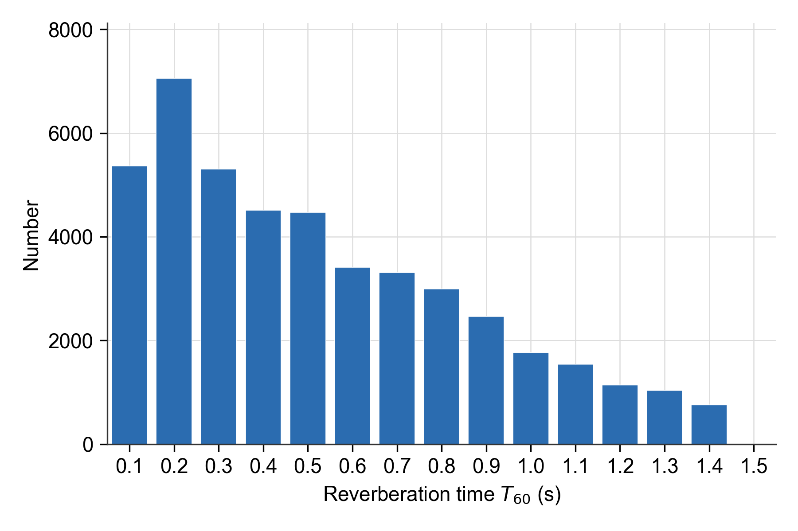
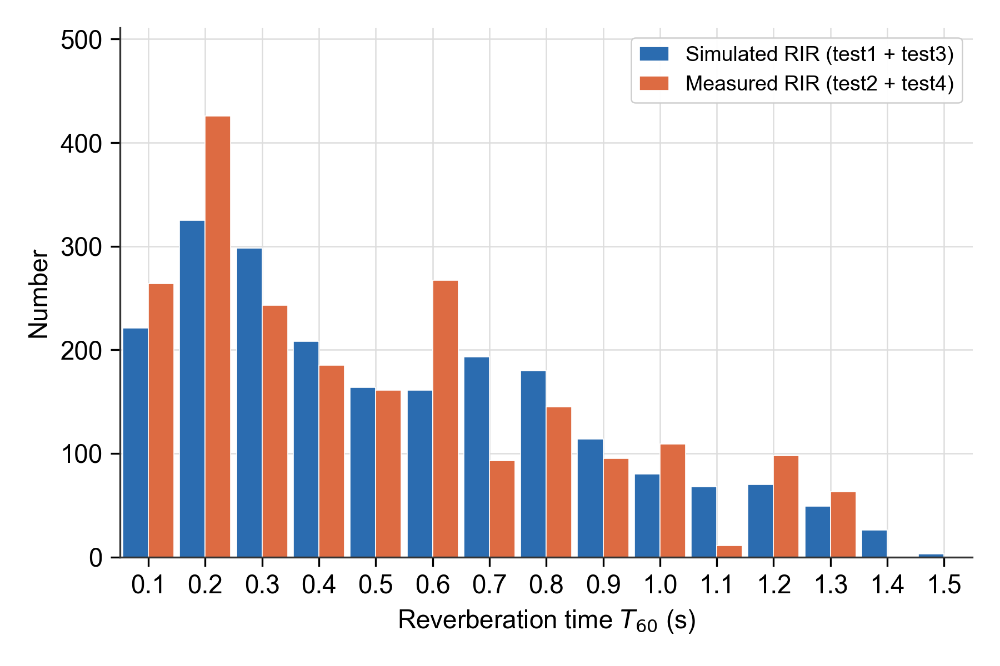
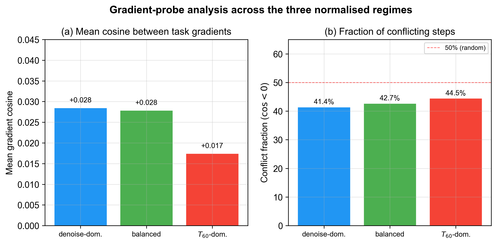
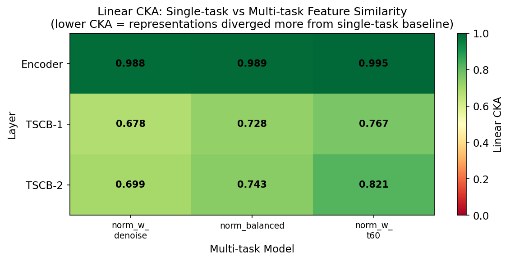
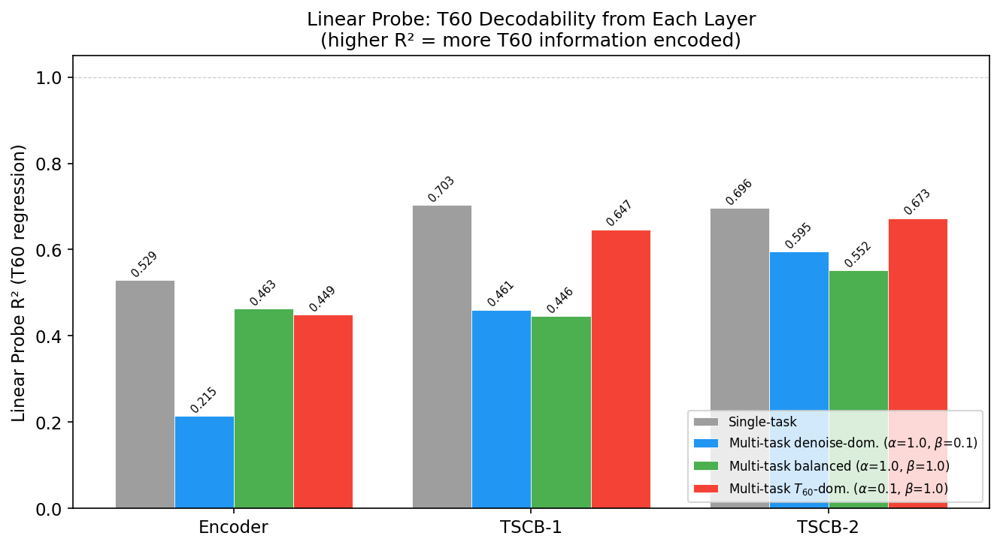

# 去噪辅助监督下的多任务盲混响时间估计：基于 Fourier Kolmogorov–Arnold 回归头的 Conformer 方法

**作者：** 谢欣妮、陆锡堃、桑晋秋（华东师范大学）

> 📌 **本文档为 review 用中文稿。** 与英文版 `docs/main.tex` 一一对应；先于此处修改，经确认后落到英文版。
> 所有实验数据已填实数（单任务基线 = `single_t60_kan_v2_mse`，RMSE 111.15 ms）。

---

## 摘要

混响时间 $T_{60}$ 是最具信息量的房间声学参数之一，然而从单通道含噪混响录音中进行盲估计仍然困难，因为晚期混响尾在能量上天然偏弱，极易被加性噪声掩蔽。我们提出一个面向盲 $T_{60}$ 估计的多任务学习框架：以 $T_{60}$ 回归为主任务，以去噪重建（含噪混响语音 $\to$ 无噪混响语音）为辅助任务，二者共享一个 dual-path time–frequency Conformer backbone。含噪混响语音的复短时傅里叶频谱经稠密卷积编码器与两个 time–frequency Conformer 块（TSCB）处理后，瓶颈特征由多统计量池化层聚合，再经两层 Fourier-KAN 头映射到 $T_{60}$；与此同时，同一瓶颈特征经掩码解码器与复数解码器重建增强语音。去噪辅助任务信息密集的逐时频点监督，迫使共享层学习精细的时频判别特征；我们验证了这种由去噪驱动的表征反过来会显著改善 $T_{60}$ 估计。与相近容量的多层感知机（MLP）回归头相比，Fourier 基把每条边上的激活函数表达为可学习的三角级数，与池化声学统计量到目标 $T_{60}$ 之间光滑但非线性的依赖关系天然契合。在覆盖仿真与真实房间脉冲响应（RIR）、已见与未见噪声类型的四个含噪混响测试集上，所提模型取得平均均方根误差（RMSE）92.91 ms、平均绝对误差（MAE）56.68 ms、Pearson 相关系数 0.9625；相比单任务消融基线（861,793 参数，RMSE 111.15 ms）RMSE 降低 16.4%。encoder 与 Conformer 块为两任务共享，去噪辅助任务新增两个解码器约 0.54M 参数，总参数 1.41M。梯度探针分析表明，两任务梯度在整个训练过程中近似正交（无系统性冲突），故可联合优化而互不干扰；任务权重消融进一步表明，去噪任务权重越大，$T_{60}$ 精度单调提升，而表征分析（CKA、线性探针）显示这一增益源于去噪任务对共享特征的**重塑**，而非任何梯度幅度主导效应。

**关键词：** 盲混响时间估计、多任务学习、去噪辅助监督、Conformer、Kolmogorov–Arnold 网络、Fourier 基、噪声鲁棒性

---

## 1 引言

当声源在一个封闭空间中发声时，接收端不仅捕获直达声，还会接收到来自周围壁面的大量反射声（Kuttruff 等，2013）。这些反射声随时间衰减，共同构成房间的混响。声源停止后，声能衰减 60 dB 所需的时间被定义为混响时间 $T_{60}$（ISO 3382-2，2008）。作为一个概括房间能量衰减行为的标量，$T_{60}$ 是表征封闭空间声学属性最常用的参数之一，直接影响语音质量、可懂度，以及去混响、语音识别、声源定位、虚拟/增强现实渲染等下游音频应用的性能（Benzeghiba 等，2007；Anthes 等，2016）。标准化测量 $T_{60}$ 的方法包括中断噪声法与积分脉冲响应法（Schroeder，1965），二者均需要全向声源、校准过的传声器与训练有素的操作人员。但这类现场测量既不便携，且在大规模或现场测量时成本高昂、实现复杂。因此，*盲*估计方法应运而生：在没有任何专用激励信号或房间几何先验的前提下，直接从录制的语音信号中推断 $T_{60}$（Eaton 等，2016）。

过去二十年间，盲 $T_{60}$ 估计积累了大量工作。传统方法依赖统计信号处理：基于模型的估计器将房间脉冲响应（RIR）的晚期部分建模为阻尼高斯过程（Polack，1988），从能量包络的衰减速率恢复 $T_{60}$；基于特征映射的估计器则从手工设计的声学描述子（如衰减速率的负侧方差、谐波分量的音高强度或谱衰减分布）中推导 $T_{60}$（Ratnam 等，2003；Wen 等，2008；Eaton 等，2013；Falk 等，2010；Löllmann 等，2010）。ACE 挑战赛对这些方法作了系统评测（Eaton 等，2016），同时也暴露出两个反复出现的困难：（i）多数估计器受加性噪声正偏置影响，因为类噪声的混响尾被埋没在噪声之中；（ii）解析衰减模型在非平稳或低信噪比（SNR）场景下十分脆弱。即便是带噪声鲁棒性改进的版本，如降低计算量的谱衰减分布估计器（Eaton 等，2013）或子带分解估计器（Prego 等，2015），仍需要一个相对准确的噪声水平先验估计，而噪声非平稳时这本身就是一个难题。

深度学习随后成为一种数据驱动的替代方案。Gamper 等（2018）将 log-mel 特征送入一个六层卷积网络，赢得 ACE 单通道赛道；Xiong 等（2018）将 $T_{60}$ 与早期混响比的联合估计建模为时频特征上的分类问题；Deng 等（2020）引入卷积循环网络以在变长语音上在线估计；Srivastava 等（2021）将该框架推广到多通道输入；Götz 等（2023）用三种卷积循环变体处理动态声学条件下的参数估计；Saini 等（2023）证明 MobileViT 风格的 transformer 可在智能手机上实时运行，而 Duangpummet 等（2022）则从全频带 $T_{60}$ 走向 $T_{60}$、早期衰减时间、清晰度与语音传输指数的联合估计。与本文最相关的是 Zheng 等（2022）和 Zhang 等（2024）：他们探索了将 $T_{60}$ 回归与一个辅助去噪目标配对的多任务形式，并观察到去噪任务能改善 $T_{60}$ 估计。尽管上述数据驱动模型在干净或高 SNR 条件下明显优于统计信号处理基线，两个普遍挑战仍贯穿这一系列工作。其一，晚期混响尾在能量上天然偏弱，易被真实噪声掩蔽，估计精度在低 SNR 或未见噪声场景下仍明显下降；已有工作主要依赖 backbone 自身容量来获取噪声鲁棒性，但这能否驱动底层学到精细的时频判别特征并不明朗，而精确的 $T_{60}$ 恰恰依赖对衰减包络细节的感知。其二，几乎所有现有估计器都在时频 backbone 之上堆叠全连接层作为回归器，每个神经元仅施加单一固定非线性，对池化瓶颈特征到标量 $T_{60}$ 这条光滑但非平凡的映射，表达能力有限。

为应对上述挑战，我们提出一个面向盲 $T_{60}$ 估计的多任务学习框架，围绕三个核心设计。其一，我们在 dual-path time–frequency Conformer encoder 基础上引入一个去噪重建辅助任务，二者共享 encoder 与 Conformer 块。去噪任务要求网络从含噪混响频谱中分离噪声、重建无噪混响语音；这一逐时频点、信息密集的监督迫使共享层学习精细的时频判别特征，我们验证了这种由去噪驱动的表征反过来会改善 $T_{60}$ 估计。其二，我们设计了一个轻量化的 Fourier 基 Kolmogorov–Arnold 回归头，其可学习的一元边函数取代常规 MLP 的固定标量非线性，为池化特征到标量 $T_{60}$ 的光滑非线性映射提供强归纳偏置。其三，我们通过系统的梯度探针与表征分析，揭示去噪辅助监督如何起作用：两任务梯度方向近似正交而非对抗，故可联合优化而互不干扰；任务权重消融显示，去噪任务权重越大，$T_{60}$ 精度单调提升；在表征层面，CKA 显示去噪任务会主动**重塑**共享层（权重越大，表征偏离单任务解越远），而正是这种重塑——而非任何梯度幅度主导效应——为 Fourier-KAN 头所利用。

**主要贡献。** 我们的具体贡献如下。

1. 我们提出一个面向盲 $T_{60}$ 估计的多任务框架：以 $T_{60}$ 回归为主任务、去噪重建为辅助任务，共享 dual-path time–frequency Conformer backbone（稠密卷积编码器与两个双阶段 Conformer 块），并在共享瓶颈之上分出 Fourier-KAN 回归头与 CMGAN 风格去噪解码分支。据我们所知，这是首次将去噪辅助监督系统性地引入 dual-path time–frequency Conformer 的盲 $T_{60}$ 回归任务。
2. 我们通过三组任务权重配置的梯度探针分析表明，两个任务的梯度方向在整个训练过程中近似正交（$\cos\approx 0$，无系统性对抗冲突），故两任务可联合优化而互不干扰。任务权重消融进一步显示，去噪任务权重越大，$T_{60}$ 精度单调提升；表征分析（CKA）表明，这一增益源于去噪任务对共享特征的重塑，而非任何梯度幅度主导效应。
3. 我们设计了一个轻量化的 Fourier 基 Kolmogorov–Arnold 回归头，以层级化频率预算的两层 Fourier-KAN 将多统计量池化特征映射到 $T_{60}$。实验证实，在相同多任务设置下该头一致优于常规 MLP 回归头。
4. 我们在覆盖仿真/真实 RIR 与已见/未见噪声类型所有组合的四个含噪混响测试集上作系统评估。两任务共享 encoder 与 Conformer 块，$T_{60}$ 估计的 RMSE 相比单任务消融基线（111.15 ms）降低 16.4%（92.91 ms 对 111.15 ms），代价是新增两个去噪解码器（约 0.54M 参数；总参数 1.41M，单任务为 861,793）。所提模型取得平均 RMSE 92.91 ms、MAE 56.68 ms、Pearson 相关系数 0.9625，并优于 BERP、DAMTL、noiseaware。

本文余下部分组织如下。第 2 节形式化声学信号模型以及 RIR 与 $T_{60}$ 的关系。第 3 节详述所提网络，包括 Conformer backbone、去噪解码分支、多统计量池化层、Fourier-KAN 回归头以及多任务训练目标。第 4 节介绍数据集、基线与实现细节。第 5 节汇报 $T_{60}$ 估计与去噪的定量结果、消融实验，以及梯度与表征分析。第 6 节总结全文。

---

## 2 信号模型

### 2.1 声学信号模型

设 $s(t)$ 为静止声源发出的无混响语音，$h(t)$ 为从声源位置到传声器的房间脉冲响应（RIR），$n(t)$ 为传声器处捕获的互不相关加性噪声。在时域上，录制的含噪混响信号 $y(t)$ 建模为

$$
y(t) = s(t)\ast h(t) + n(t), \tag{1}
$$

其中 $\ast$ 表示卷积。对式 (1) 作短时傅里叶变换得到 $Y(k,l) \approx S(k,l)\,H(k,l) + N(k,l)$，其中 $k$、$l$ 分别索引频率窗与时间帧。盲 $T_{60}$ 估计旨在学习一个映射 $\mathcal{F}:Y \mapsto \hat{T}_{60}$，仅以录制信号的复 STFT 作为输入，无法访问 $S$、$H$ 或 $N$。

### 2.2 混响时间与 Polack 模型

要从观测信号 $y(t)$ 估计 $T_{60}$，需要理解 $T_{60}$ 与 RIR $h(t)$ 结构之间的关系。在 Polack 模型下（Polack，1988），晚期 RIR 被描述为零均值阻尼高斯过程，

$$
h(t) = b(t)\, e^{-\delta t},\qquad t\geq 0, \tag{2}
$$

其中 $b(t)$ 是方差为 $\sigma_b^{2}$ 的平稳独立同分布序列，$\delta>0$ 为房间的阻尼常数。由式 (2) 的二阶统计可得平方能量包络的衰减规律

$$
\mathbb{E}\{|h(t)|^{2}\} = \sigma_b^{2}\,e^{-2\delta t}, \tag{3}
$$

混响时间可解析地写为

$$
T_{60} = \frac{3\ln 10}{\delta}. \tag{4}
$$

基于模型的估计器通过对（估计得到的）能量包络取对数后作线性回归来拟合衰减速率 $\delta$。然而当混响语音被噪声污染时，包络不再为纯指数，$\delta$ 的估计会产生严重偏置，通常导致 $T_{60}$ 被高估（Gaubitch 等，2012）。这一局限正是使用数据驱动方法、直接学习从 $Y(k,l)$ 到 $\hat{T}_{60}$ 映射的动机。

---

## 3 所提方法

本节描述所提的多任务 $T_{60}$ 估计网络。如图 1 所示，网络由一个**共享主干**与两个任务分支组成。共享主干包括：（i）一个复数频谱*稠密卷积编码器*，将含噪混响波形转化为高维时频表示；以及（ii）由 $N{=}2$ 个堆叠的*双阶段 Conformer 块*（TSCB；其内部结构见图 2）捕获长程时频依赖。所得瓶颈特征馈入两条并行分支：（iii）*Fourier-KAN 回归头*——将瓶颈输出聚合为单一归一化 $T_{60}$ 估计（主任务）；（iv）*去噪解码分支*（掩码解码器 + 复数解码器）——重建增强语音（辅助任务）。两条分支共享 encoder 与 Conformer 块并联合训练，使去噪梯度作为共享表征的正则化器；训练目标 $\mathcal{L}=\alpha\,\mathcal{L}_{\text{den}}^{*}+\beta\,\mathcal{L}_{T_{60}}^{*}$（任务权重 $(\alpha,\beta)$ 在第 5 节调优）详见 §3.5。

### 3.1 稠密卷积编码器

稠密卷积编码器将含噪混响波形转化为两任务共享的高维时频表示。所有录音重采样至 16 kHz、转为单声道，并截断到固定长度 4 s，每条语音 $L=64\,000$ 个样本。为使输入统计量与绝对录音电平无关，每个波形 $y[n]$ 乘以能量归一化因子

$$
c = \sqrt{\frac{L}{\sum_{n=0}^{L-1} y^{2}[n]+\varepsilon}},\qquad \tilde{y}[n] = c\,y[n], \tag{5}
$$

其中 $\varepsilon=10^{-8}$ 用于数值稳定，训练与推理采用相同归一化。随后以 $N=400$ 个样本的 Hamming 分析窗、$H=100$ 个样本的帧移计算复 STFT，得到 $T=641$ 帧、$F=201$ 个频率窗的复频谱 $\mathbf{Y}\in\mathbb{C}^{T\times F}$；将其实部与虚部堆叠为双通道张量，并拼接幅度 $|\mathbf{Y}|=\sqrt{\mathrm{Re}(\mathbf{Y})^{2}+\mathrm{Im}(\mathbf{Y})^{2}}$ 作为第三通道，得到输入张量

$$
\mathbf{X}_{\mathrm{in}} = \bigl[\,|\mathbf{Y}|,\; \mathrm{Re}(\mathbf{Y}),\;\mathrm{Im}(\mathbf{Y})\,\bigr] \in\mathbb{R}^{3\times T\times F}. \tag{6}
$$

编码器采用三阶段稠密卷积设计。一个逐点卷积首先将三通道输入投影到 $C=64$ 通道，其后接 instance normalization 与 parametric ReLU。一个深度 $D=4$ 的*膨胀稠密块*随后施加四个级联的 $2\times 3$ 卷积，每个卷积的输入由此前所有卷积的输出拼接而成；第 $d$ 个卷积沿时间轴的膨胀率为 $2^{d-1}$，在控制参数量的同时指数级扩大时间感受野。每个卷积后接 instance normalization 与 PReLU 激活。最后，一个步长 $1\times 3$ 卷积将频率轴下采样两倍，得到编码器瓶颈

$$
\mathbf{F}^{(0)} = \mathrm{Encoder}(\mathbf{X}_{\mathrm{in}}) \in \mathbb{R}^{C\times T\times F'}, \tag{7}
$$

其中 $C=64$、$T=641$、$F'=101$。

### 3.2 双阶段 Conformer 块

编码器瓶颈 $\mathbf{F}^{(0)}$ 随后由 $N=2$ 个堆叠的双阶段 Conformer 块（TSCB）进一步细化。Conformer 块（Gulati 等，2020）将自注意力的全局建模能力与卷积的局部特征提取相结合，已成为语音增强与说话人分离的标准序列建模选择。对长度为 $L$、特征维 $d$ 的序列 $\mathbf{Z}\in\mathbb{R}^{L\times d}$，该块由四个被残差连接包裹的子模块组成：

$$
\begin{aligned}
\mathbf{Z}_1 &= \mathbf{Z} + \tfrac{1}{2}\,\mathrm{FFN}_1(\mathbf{Z}),\\
\mathbf{Z}_2 &= \mathbf{Z}_1 + \mathrm{MHSA}(\mathbf{Z}_1),\\
\mathbf{Z}_3 &= \mathbf{Z}_2 + \mathrm{Conv}(\mathbf{Z}_2),\\
\mathbf{Z}_4 &= \mathrm{LayerNorm}\bigl(\mathbf{Z}_3 + \tfrac{1}{2}\,\mathrm{FFN}_2(\mathbf{Z}_3)\bigr),
\end{aligned} \tag{8}
$$

其中 $\mathrm{FFN}_1$、$\mathrm{FFN}_2$ 为两个 pre-normalization 的位置式前馈模块（Swish 激活），$\mathrm{MHSA}$ 为带 Shaw 式相对位置编码（Shaw 等，2018）的多头自注意力模块，$\mathrm{Conv}$ 为带门控线性单元与 batch normalization 的深度可分离一维卷积模块。两个前馈分支的半尺度构成了所谓的 "Macaron" 结构，已被证明能稳定优化（Gulati 等，2020）。

将 Conformer 块应用于语音的时频表示时，通常以 dual-path 方式部署：堆叠两个 Conformer 块，一个沿时间轴、一个沿频率轴运算，共同构成一个两阶段 Conformer 块（TSCB）（Cao 等，2022）。具体地，对输入特征图 $\mathbf{F}\in\mathbb{R}^{B\times C\times T\times F'}$：

$$
\mathbf{F}^{t} = \mathbf{F} + \mathrm{ConformerBlock}_{t}\bigl(\mathrm{Reshape}_{t}(\mathbf{F})\bigr), \tag{9}
$$

其中 $\mathrm{Reshape}_{t}$ 将频率轴并入 batch 维、把时间轴作为序列轴；Conformer 块随后作用于形状 $(B\,F')\times T\times C$ 的张量。类似地，

$$
\mathbf{F}^{tf} = \mathbf{F}^{t} + \mathrm{ConformerBlock}_{f}\bigl(\mathrm{Reshape}_{f}(\mathbf{F}^{t})\bigr), \tag{10}
$$

$\mathrm{Reshape}_{f}$ 产生形状 $(B\,T)\times F'\times C$ 的张量。每个 Conformer 块有 $h=4$ 个维 $d_h=C/4=16$ 的注意力头、前馈扩展因子 4、卷积核大小 31 的深度可分离一维卷积，以及注意力与前馈子模块上 0.2 的 dropout。第二个 TSCB 之后，瓶颈特征图记为 $\mathbf{F}^{(N)}\in\mathbb{R}^{C\times T\times F'}$；该瓶颈由 $T_{60}$ 回归头（§3.3）与去噪分支（§3.4）共享。当 $C=64$、$T=641$、$F'=101$ 时，逐块自注意力在 $T$ 或 $F'$ 上为二次复杂度，但得益于 dual-path 分解，在乘积 $T\,F'$ 上仅为线性复杂度——这正是 4 秒窗口能在单 GPU 上可行的原因。

### 3.3 $T_{60}$ 回归头

$T_{60}$ 回归头将共享瓶颈 $\mathbf{F}^{(N)}$ 经两步池化与一个 Fourier-KAN 块凝缩为单一的归一化 $T_{60}$ 估计。首先对频率轴求平均，反映 $T_{60}$ 概括的是房间宽带属性而非特定谱型的假设：

$$
\mathbf{Z}_{c,t} = \frac{1}{F'}\sum_{f=1}^{F'}\mathbf{F}^{(N)}_{c,t,f}, \tag{11}
$$

得到 $\mathbf{Z}\in\mathbb{R}^{C\times T}$。随后由多统计量池化层沿时间维计算均值、最大值与标准差（Snyder 等，2018）：

$$
\mathbf{e} = \bigl[\,\mu(\mathbf{Z}),\; \max(\mathbf{Z}),\;\sigma(\mathbf{Z})\,\bigr] \in \mathbb{R}^{3C}. \tag{12}
$$

三个统计量携带关于语音能量包络的互补信息：$\mu(\mathbf{Z})$ 概括长期平均电平，$\max(\mathbf{Z})$ 捕获通常与元音起音相关的峰值激励，$\sigma(\mathbf{Z})$ 捕获包络的时间调制，而已知后者与晚期混响尾的衰减速率强相关（Falk 等，2010）。当 $C=64$ 时，所得嵌入有 $3C=192$ 个元素。

**Kolmogorov–Arnold 基。** Kolmogorov–Arnold 表示定理指出，任意连续多元函数 $f:[0,1]^{n}\to\mathbb{R}$ 都可写作连续一元函数与加法的有限复合。Liu 等（2024）据此提出 Kolmogorov–Arnold 网络（KAN）：用置于网络每条*边*上的可学习一元函数取代多层感知机（MLP）的固定标量非线性。一个输入维 $I$、输出维 $O$ 的 KAN 层实现映射

$$
y_j = \sum_{i=1}^{I} \phi_{j,i}(x_i) + b_j, \qquad j=1,\ldots,O, \tag{13}
$$

其中每个 $\phi_{j,i}:\mathbb{R}\to\mathbb{R}$ 为可学习一元函数，$b_j$ 为每个输出的偏置。原 KAN 论文以三次 B 样条参数化 $\phi_{j,i}$，表达力强但需要自适应网格更新等簿记工作，在回归头典型的小批量下相对较慢。Fourier-KAN 以截断三角级数取代样条基（作者待核，2024）。对*频率预算* $\Omega\in\mathbb{N}$，每条边函数写作

$$
\phi_{j,i}(x_i) = \sum_{\omega=1}^{\Omega} \bigl[a_{j,i,\omega}\,\cos(\omega\,x_i) + b_{j,i,\omega}\,\sin(\omega\,x_i)\bigr], \tag{14}
$$

于是 Fourier-KAN 层的输出为

$$
y_j = \sum_{i=1}^{I}\sum_{\omega=1}^{\Omega} \bigl[a_{j,i,\omega}\cos(\omega x_i) + b_{j,i,\omega}\sin(\omega x_i)\bigr] + b_j. \tag{15}
$$

每层可训练参数数为 $2\,O\,I\,\Omega + O$，是同等 $O\times I$ 线性层的若干倍，但在 $I$、$O$ 较小时绝对量仍然很小。两个性质使该基适合作为本文回归头：（i）权重的梯度是输入的闭式三角函数，无需维护网格；（ii）该基对光滑且近似周期的依赖关系有强归纳偏置，与池化瓶颈特征到 $T_{60}$ 的经验映射形状相符。池化嵌入 $\mathbf{e}\in\mathbb{R}^{192}$ 经线性投影、两层 Fourier-KAN 与一个最终线性输出映射到 $\hat{T}_{60}$，分述如下。

**投影。** 一个线性投影后接 layer normalization，将池化嵌入降为 $d_{0}=64$ 维向量，

$$
\mathbf{u}^{(0)} = \mathrm{LayerNorm}\bigl(\mathbf{W}_{p}\,\mathbf{e}+\mathbf{b}_{p}\bigr), \qquad \mathbf{u}^{(0)}\in\mathbb{R}^{d_{0}}. \tag{16}
$$

layer normalization 之后不再施加额外激活：归一化已约束了首个 Fourier 层的输入范围，而 tanh 这类饱和非线性会削弱周期基的有效容量。

**Fourier-KAN 块。** 投影后的嵌入经 $L=2$ 层 Fourier-KAN 处理，隐层维度 $(d_{1},d_{2})=(32,16)$。首层使用较大的频率预算 $\Omega_{0}=16$，使其能直接从嵌入学习细粒度非线性特征；内层使用较小的预算 $\Omega_{1}=8$ 以提高参数效率。形式上，对 $\ell=1,2$，

$$
u^{(\ell)}_j = \sum_{i=1}^{d_{\ell-1}}\sum_{\omega=1}^{\Omega_{\ell-1}} \bigl[a^{(\ell)}_{j,i,\omega}\cos(\omega u^{(\ell-1)}_i) + b^{(\ell)}_{j,i,\omega}\sin(\omega u^{(\ell-1)}_i)\bigr] + c^{(\ell)}_j, \tag{17}
$$

层输出再经 layer normalization 与概率 0.1 的 dropout 后处理：

$$
\mathbf{u}^{(\ell)} \leftarrow \mathrm{Dropout}\bigl(\mathrm{LayerNorm}(\mathbf{u}^{(\ell)})\bigr). \tag{18}
$$

Fourier 权重 $a^{(\ell)}_{j,i,\omega}$、$b^{(\ell)}_{j,i,\omega}$ 以标准差 $\sqrt{1/(d_{\ell-1}\,\Omega_{\ell-1})}$ 的零均值高斯初始化，使层输出方差在初始化时近似为单位量，与输入维和频率预算无关。

**输出。** 一个线性层将 $\mathbf{u}^{(2)}\in\mathbb{R}^{16}$ 映射为标量，经 sigmoid 得到归一化估计

$$
\hat{T}_{60}^{\mathrm{norm}} = \sigma\bigl(\mathbf{w}_{o}^{\top}\mathbf{u}^{(2)} + b_{o}\bigr) \in (0,1). \tag{19}
$$

### 3.4 去噪解码分支

为向共享主干注入去噪监督，我们在瓶颈特征 $\mathbf{F}^{(N)}$ 之上分出一条解码分支，采用掩码 + 复数残差结构。一个掩码解码器输出幅度掩码 $\mathbf{M}\in\mathbb{R}^{1\times T\times F}$，与输入幅度相乘得到掩蔽后的幅度 $\hat{M}=|\mathbf{Y}|\odot\mathbf{M}$；一个复数解码器输出复数残差 $\Delta\in\mathbb{R}^{2\times T\times F}$。结合含噪相位 $\angle\mathbf{Y}$，重建增强频谱的实部与虚部为

$$
\hat{Y}_{\mathrm{re}} = \hat{M}\cos(\angle\mathbf{Y}) + \Delta_{\mathrm{re}},\qquad
\hat{Y}_{\mathrm{im}} = \hat{M}\sin(\angle\mathbf{Y}) + \Delta_{\mathrm{im}}, \tag{20}
$$

再经 iSTFT 得到增强时域语音。两个解码器均采用与 encoder 对称的稠密设计。

### 3.5 损失函数

为匹配式 (19) 中 sigmoid 的输出范围，每个真值 $T_{60}$ 在送入损失前线性映射到 $[0,1]$：

$$
T_{60}^{\mathrm{norm}} = \frac{T_{60} - T_{\min}}{T_{\max} - T_{\min}}. \tag{21}
$$

$T_{60}$ 回归损失为 $B$ 条语音小批量上预测与真值归一化 $T_{60}$ 之间的均方误差：

$$
\mathcal{L}_{T_{60}}(\boldsymbol{\theta}) = \frac{1}{B}\sum_{i=1}^{B}\bigl(\hat{T}_{60,i}^{\mathrm{norm}} - T_{60,i}^{\mathrm{norm}}\bigr)^{2}. \tag{22}
$$

去噪损失结合压缩域实/虚部损失、幅度损失与时域损失：

$$
\mathcal{L}_{\text{den}} = w_{ri}\,\mathcal{L}_{ri} + w_{mag}\,\mathcal{L}_{mag} + w_{time}\,\mathcal{L}_{time}, \tag{23}
$$

其中 $\mathcal{L}_{ri}$、$\mathcal{L}_{mag}$ 分别为（功率压缩后）增强频谱实/虚部与幅度相对无噪混响目标 $\tilde{S}$ 的均方误差，$\mathcal{L}_{time}$ 为 iSTFT 增强波形与 $\tilde{s}$ 的 $\ell_{1}$ 损失。

由于去噪损失与 $T_{60}$ 损失的原始量级不同，直接加权时权重 $\alpha/\beta$ 难以直观反映两任务对共享层的相对贡献。为使两损失能在同一尺度上加权，我们将二者各自除以自身的指数移动平均（EMA）归一到单位量级，记为 $\mathcal{L}_{\text{den}}^{*}$、$\mathcal{L}_{T_{60}}^{*}$，总损失为

$$
\mathcal{L}(\boldsymbol{\theta}) = \alpha\,\mathcal{L}_{\text{den}}^{*}(\boldsymbol{\theta}) + \beta\,\mathcal{L}_{T_{60}}^{*}(\boldsymbol{\theta}), \tag{24}
$$

其中 $\boldsymbol{\theta}$ 收集共享 encoder 与 TSCB、Fourier-KAN 头及两个去噪解码器的所有可训练参数；去噪损失子权重 $(w_{ri},w_{mag},w_{time})=(0.1,0.9,0.2)$。$(\alpha,\beta)$ 的具体取值及所对应的主模型配置见 §4.2。

推理时将 sigmoid 输出按式 (21) 的逆映射反归一化，得到最终估计 $\hat{T}_{60}\in[T_{\min}, T_{\max}]$。

---

## 4 实验

### 4.1 数据集

实验数据集由 16 kHz 单声道、约 4 秒的含噪混响语音片段组成，$T_{60}$ 覆盖 $[0.1, 1.5]$ s，SNR 覆盖 $-5$ 至 $20$ dB。数据集包含训练集 $40\,000$ 条、验证集 $5\,136$ 条，以及四个各含 $1\,080$ 条的测试集，构成仿真/真实 RIR 与已见/未见噪声的 $2\times 2$ 设计：

| 测试集 | RIR | 噪声 |
|---|---|---|
| test1 | 仿真（image-source 法） | 已见 |
| test2 | 真实（实测脉冲响应） | 已见 |
| test3 | 仿真（image-source 法） | 未见 |
| test4 | 真实（实测脉冲响应） | 未见 |

其中"已见/未见"指噪声类型是否在训练集中出现。该设计用于评估模型在不同 RIR 真实度与噪声泛化条件下的稳健性。下图为训练池与测试集（按 RIR 类型）的 $T_{60}$ 分布。

### 4.2 对比方法与评估指标

**对比方法。** 将所提模型与三种盲 $T_{60}$ 估计方法在同一数据集上对比：（i）BERP（Wang 等，2025），采用注意力机制与卷积层相结合的统一房间特征编码器及多个分参数预测器的通用盲房间参数估计框架；（ii）DAMTL（Zhang 等，2024），以去噪为辅助任务的多任务 $T_{60}$ 估计；（iii）noise-aware 时频掩蔽方法（Zheng 等，2022），两阶段框架。三种方法均在 T60\_Dataset\_v7 上以相同划分重新训练/评估，以保证对比公平。

**评估指标。** $T_{60}$ 估计精度与去噪质量采用以下指标评估。

*$T_{60}$ 估计：*

- **均方根误差（RMSE）**：$\mathrm{RMSE}=\sqrt{\frac{1}{N}\sum_{i=1}^{N}(\hat{T}_{60,i}-T_{60,i})^{2}}$。估计残差的标准差，对大误差惩罚更重，越小越好。$T_{60}$ 以毫秒报告。
- **平均绝对误差（MAE）**：$\mathrm{MAE}=\frac{1}{N}\sum_{i=1}^{N}|\hat{T}_{60,i}-T_{60,i}|$。平均绝对偏差，与 $T_{60}$ 同量纲，越小越好。
- **Pearson 相关系数（$r$）**：估计与真值的线性相关，取值 $[-1,1]$，越接近 1 越好。
- **决定系数（$R^{2}$）**：$R^{2}=1-\frac{\sum_{i}(\hat{T}_{60,i}-T_{60,i})^{2}}{\sum_{i}(T_{60,i}-\bar{T}_{60})^{2}}$。估计解释的真值方差占比，取值 $(-\infty,1]$，越接近 1 越好。

除整体指标外，还按 $T_{60}$ 区间（$0.1$ s 步长）与 SNR 分 bin 报告 RMSE 与 $r$。

*去噪：*

- **PESQ**：宽带感知语音质量（ITU-T P.862.2），取值 $-0.5\sim 4.5$，越大越好。
- **STOI**：短时客观可懂度，取值 $0\sim 1$ 的可懂度度量，越大越好。
- **SI-SDR（dB）**：$\mathrm{SI\text{-}SDR}=10\log_{10}\frac{\lVert\mathbf{s}_{\mathrm{target}}\rVert^{2}}{\lVert\mathbf{e}_{\mathrm{noise}}\rVert^{2}}$。尺度不变的重建保真度，越大越好。

所有去噪指标均在含噪输入与增强输出上计算并报告提升量。如 §3.4 所述，去噪 target 为无噪混响语音，故这些指标衡量的是去噪（而非去混响）质量。

### 4.3 模型与训练设置

模型结构详见 §3（共享 DenseEncoder + 两 TSCB + Fourier-KAN 回归头 + CMGAN 去噪解码器），此处仅交代训练配置。所有录音重采样至 16 kHz 单声道、截取/补零到 4 秒。采用 AdamW 优化器（学习率 $5\times10^{-4}$、权重衰减 $10^{-5}$），批大小 16，梯度裁剪 $5.0$，混合精度训练，最多 100 个 epoch，验证集 RMSE 连续 15 个 epoch 不下降则早停。按 §3.5 将去噪与 $T_{60}$ 损失各自 EMA 归一化后，以 $\mathcal{L}=\alpha\,\mathcal{L}_{\text{den}}^{*}+\beta\,\mathcal{L}_{T_{60}}^{*}$ 联合训练；任务权重 $(\alpha,\beta)$ 在 §5.1 调优。

为检验两任务在共享层上是否相互干扰，每 $20$ 个训练步在主反向传播前测量去噪损失与 $T_{60}$ 损失对三个共享模块（DenseEncoder、TSCB\_1、TSCB\_2）的*归一化但未加权*梯度的余弦相似度 $\cos$。

---

## 5 结果与讨论

### 5.1 消融实验

**任务权重调优。** 我们首先调优归一化损失 $\mathcal{L}=\alpha\,\mathcal{L}_{\text{den}}^{*}+\beta\,\mathcal{L}_{T_{60}}^{*}$ 的任务权重 $(\alpha,\beta)$。表 2 报告了覆盖去噪主导、持平、$T_{60}$ 主导三档的五组配置的 $T_{60}$ 精度。精度随去噪权重相对 $T_{60}$ 权重的增大而单调提升，在 $(\alpha,\beta)=(1.0,0.05)$ 取得最优（RMSE 92.91 ms）——故本文以此配置作为主模型。一旦去噪权重降至持平或 $T_{60}$ 主导档，RMSE 退化至约 110 ms，已不优于单任务基线（111.15 ms），证实只有当去噪任务获得明显更大的权重时精度才改善。

**表 2　任务权重消融（归一化损失；test1–test4 平均）。$T_{60}$ 精度随去噪权重比 $\alpha/\beta$ 增大而提升，$(1.0,0.05)$ 最优。**

| 配置 | $(\alpha,\beta)$ | RMSE (ms) ↓ | MAE (ms) ↓ |
|---|---|---|---|
| 去噪主导（主模型） | (1.0, 0.05) | **92.91** | **56.68** |
| 去噪主导 | (1.0, 0.1) | 97.79 | 57.95 |
| 去噪主导 | (1.0, 0.3) | 107.10 | 64.28 |
| 持平 | (1.0, 1.0) | 109.90 | 67.16 |
| $T_{60}$ 主导 | (0.1, 1.0) | 109.54 | 68.15 |

为检验两任务是否会相互干扰，我们用 §4.3 的梯度探针测量训练全程中两任务梯度在共享 encoder 上的余弦 $\cos$。如图所示，$\cos$ 始终集中在 0 附近（$|\cos|$ 均值约 0.10，仅约 41% 的步数 $\cos<0$）：两任务梯度近似正交，既非协同对齐也非系统性冲突。因此两任务可联合优化而互不干扰，决定 $T_{60}$ 精度的是任务权重比——即允许去噪任务在多大程度上塑造共享表征——而非任何梯度冲突。这种塑造在表征层面如何发生，见 §5.2。

**回归头消融。** 我们进一步在相同的多任务配置 $(\alpha,\beta)=(1.0,0.05)$ 下，对比 Fourier-KAN 回归头与相近容量的 MLP 头。

**表 3　回归头消融（多任务设置 $(\alpha,\beta)=(1.0,0.05)$）**

| 回归头 | RMSE (ms) ↓ | MAE (ms) ↓ |
|---|---|---|
| MLP | *【待填】* | *【待填】* |
| Fourier-KAN | **92.91** | **56.68** |

### 5.2 表征分析

为说明去噪辅助监督如何重塑共享表征、进而惠及 $T_{60}$，我们对各共享层做 CKA（比较各多任务配置与单任务基线在各层的特征相似度）与线性探针（冻结模型，以线性回归读出 $T_{60}$，看各层表征的 $T_{60}$ 可分性 R²）。CKA 基于完整特征 Gram 矩阵作确定性计算，数值稳定；线性探针 R² 采用随机 train/test 划分，存在一定抖动，故仅作定性交叉验证，不作逐点比较。

CKA 揭示了一个清晰的、随深度递进的规律。在 encoder 层，三档多任务配置都与单任务基线几乎一致（CKA 0.988–0.995）：底层幅度/相位编码器很大程度上与任务无关。向深层推进，TSCB-1 与 TSCB-2 显著偏离，且偏离幅度随去噪梯度强度**单调递增**：在 TSCB-2 上，去噪主导档（$\alpha{=}1.0,\beta{=}0.1$）偏离最远（CKA 0.699），持平档居中（0.743），而抑制了去噪梯度的 $T_{60}$ 主导档（$\alpha{=}0.1,\beta{=}1.0$）最贴近单任务解（0.821）。这一 CKA 排序与表 2 的 $T_{60}$ 精度排序完全一致（去噪主导最优、$T_{60}$ 主导最差）：去噪梯度对共享表征的重塑越强，$T_{60}$ RMSE 越低。换言之，*更强的去噪梯度所做的不仅是叠加第二个目标——它主动重塑了共享表征，而正是这种重塑让 $T_{60}$ 头受益。*

线性探针（图 7）进一步确认，这种重塑并未丢弃 $T_{60}$ 信息：四个模型在深层都保持了相当的 $T_{60}$ 可解码性（TSCB-2 的 R² 都落在 0.55–0.70 区间），说明去噪监督并未简单抹除 $T_{60}$ 线索。线性探针与 CKA 的对照颇有启发：多任务表征与单任务表征可度量地*不同*（TSCB-2 低 CKA），却仍承载着相当水平的 $T_{60}$ 信号——即去噪是把 $T_{60}$ 线索**重新编码**而非**移除**。真实的 $T_{60}$ 头通过 max/std 多统计量池化 + Fourier-KAN 非线性层读取这些特征，能够访问去噪主导档所重塑出的新表征；这与 §5.1 的回归头消融一致——在该消融中 Fourier-KAN 头优于相近容量的 MLP 头。

### 5.3 与基线的结果对比

我们将所提模型（归一化主模型，去噪主导档 $\alpha=1.0,\beta=0.05$，由 §5.1 权重调优确定）与三种盲 $T_{60}$ 估计方法（BERP、noiseaware、DAMTL）及单任务消融基线，在同一数据集的四个测试集上对比，平均指标见表 4。

**表 4　主对比结果（T60\_Dataset\_v7，test1–test4 平均；RMSE/MAE 单位 ms）**

| 方法 | RMSE ↓ | MAE ↓ | $r$ ↑ | R² ↑ |
|---|---|---|---|---|
| BERP（Wang 等，2025） | 151.93 | 98.33 | 0.9035 | 0.8001 |
| noiseaware（Zheng 等，2022） | 133.66 | 82.38 | 0.9196 | 0.8451 |
| DAMTL（Zhang 等，2024） | 138.94 | 86.07 | 0.9134 | 0.8323 |
| 单任务 KAN（消融基线） | 111.15 | 72.40 | 0.9484 | 0.8931 |
| **本文（归一化主模型）** | **92.91** | **56.68** | **0.9625** | **0.9253** |

所提模型在四个测试集（test1–4 = 仿真/真实 RIR × 已见/未见噪声）上均优于三种对比方法与单任务基线，RMSE 相比单任务基线降低 16.4%（92.91 ms vs 111.15 ms），验证了"去噪辅助任务 + 归一化多任务训练"的有效性与跨场景稳健性。

### 5.4 信噪比对估计精度的影响

表 5 报告所提模型与三种基线方法在各 SNR 区间的 RMSE（test1–test4 平均）。

**表 5　各 SNR 区间的 RMSE (ms)。每个场景合并同 RIR 类型的两个测试集；"Avg."为四测试集平均。每格最优加粗。**

| 场景 | 方法 | $-5$ dB | $0$ dB | $5$ dB | $10$ dB | $\geq 15$ dB | Avg. |
|---|---|---|---|---|---|---|---|
| **仿真 RIR** (test1+3) | BERP | | | | | | |
| | noiseaware | | | | | | |
| | DAMTL | | | | | | |
| | Proposed | | | | | | |
| **真实 RIR** (test2+4) | BERP | | | | | | |
| | noiseaware | | | | | | |
| | DAMTL | | | | | | |
| | Proposed | | | | | | |
| **全部** (test1–4) | BERP | | | | | | |
| | noiseaware | | | | | | |
| | DAMTL | | | | | | |
| | **Proposed** | | | | | | **92.91** |

### 5.5 混响时间对估计精度的影响

表 6 报告所提模型与三种基线方法在各 $T_{60}$ 区间的 RMSE，按测试集场景分组。

**表 6　各 $T_{60}$ 区间 (s) 的 RMSE (ms)。每个场景合并同 RIR 类型的两个测试集；"Avg."为四测试集平均。每格最优加粗。**

| 场景 | 方法 | $0.1$–$0.4$ | $0.4$–$0.7$ | $0.7$–$1.0$ | $1.0$–$1.5$ | Avg. |
|---|---|---|---|---|---|---|
| **仿真 RIR** (test1+3) | BERP | | | | | |
| | noiseaware | | | | | |
| | DAMTL | | | | | |
| | Proposed | | | | | |
| **真实 RIR** (test2+4) | BERP | | | | | |
| | noiseaware | | | | | |
| | DAMTL | | | | | |
| | Proposed | | | | | |
| **全部** (test1–4) | BERP | | | | | |
| | noiseaware | | | | | |
| | DAMTL | | | | | |
| | **Proposed** | | | | | **92.91** |

### 5.6 去噪结果

表 7 报告三档归一化配置的去噪质量（test1–test4 平均）。按 §3.4 定义的目标，这些指标反映在保留混响前提下的噪声去除。

**表 7　三档归一化配置的去噪指标（test1–test4 平均）**

| 配置 | PESQ ↑ | STOI ↑ | SI-SDR (dB) ↑ | ΔSI-SDR |
|---|---|---|---|---|
| 含噪输入 | 2.721 | 0.847 | 15.91 | — |
| $T_{60}$ 主导 | 3.077 | 0.891 | 18.80 | +2.89 |
| 持平 | 3.178 | 0.907 | 19.79 | +3.88 |
| **去噪主导（主模型）** | **3.427** | **0.927** | **20.98** | **+5.07** |

所提去噪主导模型在保留混响的前提下去除加性噪声，相比含噪输入获得 +0.71 PESQ、+0.08 STOI、+5.07 dB SI-SDR 的提升。关键的是，去噪质量的排序与 $T_{60}$ 精度的排序（表 2）**完全一致**：去噪主导档两项任务都最优，$T_{60}$ 主导档两项任务都最差。因此辅助任务与主任务之间不存在权衡——给去噪任务更大权重能同时改善两任务，这与 §5.1 的任务权重消融结果一致。

---

## 6 结论

本文提出一个面向盲 $T_{60}$ 估计的多任务学习框架，以 $T_{60}$ 回归为主任务、去噪重建为辅助任务，共享 dual-path time–frequency Conformer backbone，并以 Fourier-KAN 回归头作 $T_{60}$ 估计。主要结论如下：（1）去噪辅助任务以约 0.54M 的解码器开销，使 $T_{60}$ 估计 RMSE 相比单任务消融基线（111.15 ms）降低 16.4%，并优于 BERP、DAMTL、noiseaware 等方法；（2）梯度探针表明，两任务梯度方向近似正交、无系统性冲突，故可联合优化而互不干扰，且任务权重消融显示去噪任务权重越大 $T_{60}$ 精度单调提升；（3）Fourier-KAN 回归头在相近设置下优于 MLP 头。表征分析（CKA 与线性探针）进一步表明，去噪任务主动**重塑**了共享表征：其权重越大，共享层偏离单任务解越远（CKA 越低），而 $T_{60}$ 线索仍保持相当的线性可解码性——即去噪是把 $T_{60}$ 信息重新编码而非移除，这种重塑后的表征正是 Fourier-KAN 头能利用、从而获得最低 RMSE 的配置。

